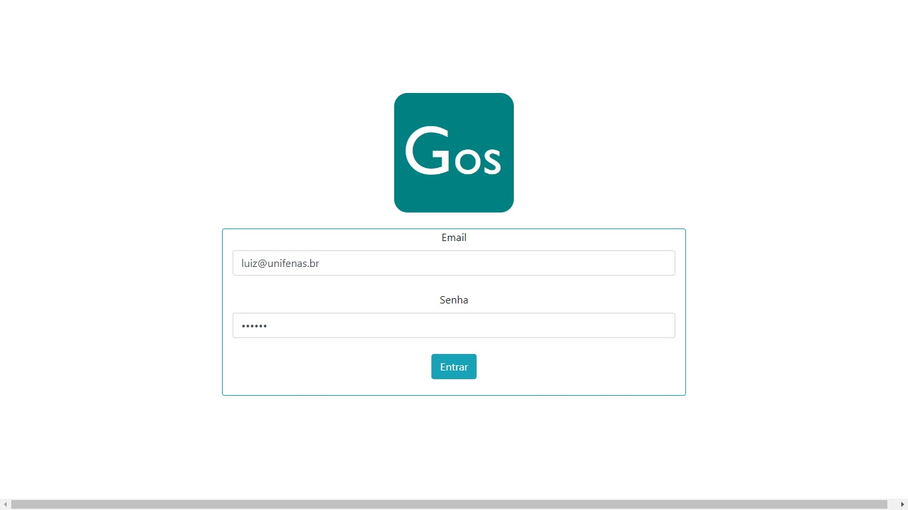
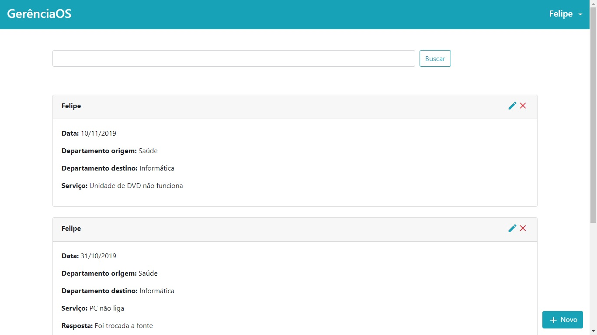
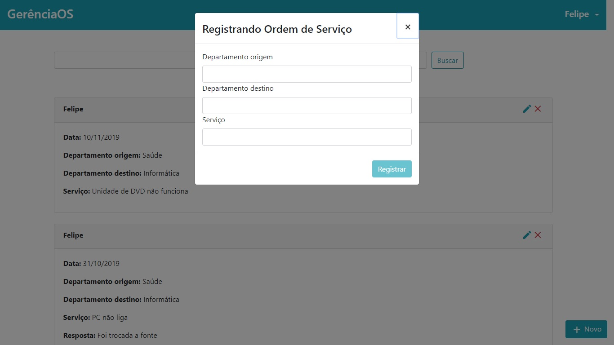
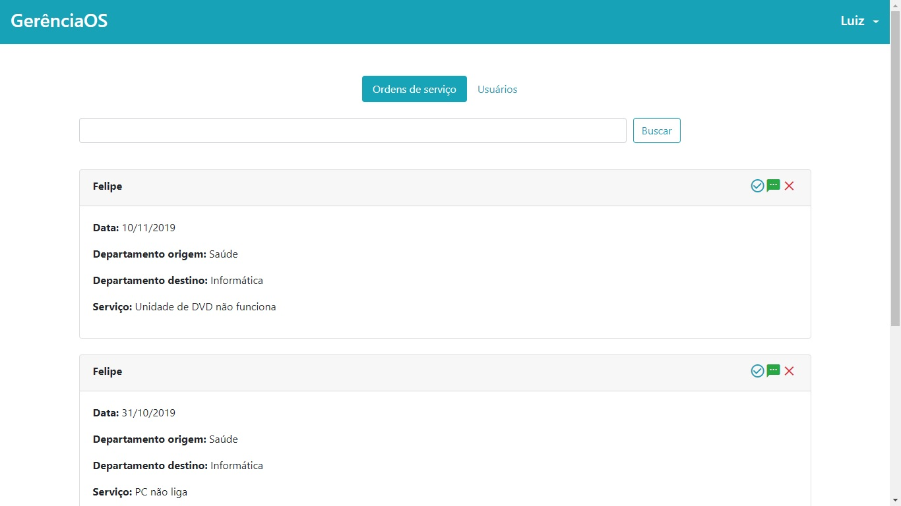

<h1
  align="center"
  style="color: #17a2b7;"
>
  📱 GerenciaOS: Gerenciador de Ordens de Serviço ⚒
</h1>

<h3
  style="color: #17a2b7;"
>
  O GerenciaOS foi criado com o objetivo de automatizar o registro e o atendimento de ordens de serviços de vários departamentos da prefeitura de Alterosa, MG.
</h3>

  Desenvolvido com Angular, o GerenciaOS foi criado com o objetivo de suprir a necessidade de otimizar o gerenciamento de ordens de serviço na Prefeitura de Alterosa, o qual era feito de forma manual, por telefone.

  A ideia do GerenciaOS foi centralizar as ordens de serviço em uma aplicação web atualizada em tempo real, de forma que as mudanças fossem percebidas em tempo real pelos usários da aplicação. Também, se fazia necessária a existência de níveis de autoridade dentro da aplicação, de modo que os funcionários pudessem cadastrar ordens de serviço apenas em seu departamento, e estas somente poderiam ser atendidas pelos administradores da aplicação.

<h4>🛠 Ferramentas e tecnologias: 🛠</h4>
<ul>
  <li>Angular</li>
  <li>ngBootstrap</li>
  <li>Firebase</li>
</ul>

<h4>📷 Capturas de tela: 📷</h4>
<table>
  <tr>
    <td>
      
    </td>
  </tr>
  <tr>
    <td>
      
    </td>
  </tr>
  <tr>
    <td>
      
    </td>
  </tr>
  <tr>
    <td>
      
    </td>
  </tr>
  <tr>
    <td>
      
    </td>
  </tr>
</table>
